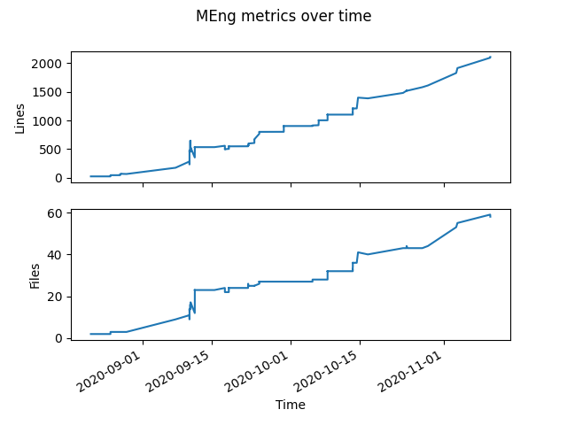

<p align="center">
  
</p>

# Jan-Hendrik Ewers MEng repo


## Explanation


## Install

```
make install
```

## Progress



## Usage 

### Global settings

```
usage: main.py [-h] [-I FILENAME] [-D X Y] [--shape X Y | -S SEARCH_RADIUS]
               [-v]
               {wp,w,sar,sim,simulate} ...

===============================================================
      ____  _____  _____    _  _      _____         _____  
     / __ \|  __ \|  __ \  | || |    / ____|  /\   |  __ \ 
    | |  | | |__) | |__) | | || |_  | (___   /  \  | |__) |
    | |  | |  ___/|  ___/  |__   _|  \___ \ / /\ \ |  _  / 
    | |__| | |    | |         | |    ____) / ____ \| | \ \ 
     \____/|_|    |_|         |_|   |_____/_/    \_\_|  \_                                                        
                                                    
    Optimal Path Planning for Search and Rescue
===============================================================

positional arguments:
  {wp,w,sar,sim,simulate}
    wp (w)              Waypoint generation utility with 4 algorithms
    sar                 SAR simulation case setup utility SMART logic
    sim (simulate)      Simulation runner

optional arguments:
  -h, --help            show this help message and exit
  -v                    Log level

PROBABILITY MAP:
  -I FILENAME, --in_file FILENAME
                        probability map image file path
  -D X Y, --dim X Y     physical dimmensions of the probability map
  --shape X Y           desired shape of the probability map (don't use for
                        physically accurate calculations)
  -S SEARCH_RADIUS, --search_radius SEARCH_RADIUS
                        search radius of drone's sensors [ b = h tan(theta) ]
```

### Waypoint Generation utility

```
usage: main.py wp [-h] [-L] [-M] [-S] [-P]
                  [--solver {fmincon,ga,particleswarm} [{fmincon,ga,particleswarm} ...]]
                  [--home HOME HOME] [-A] [-T] [-O FILENAME]

===================================================
    __          _______     _____ ______ _   _ 
    \ \        / /  __ \   / ____|  ____| \ | |
     \ \  /\  / /| |__) | | |  __| |__  |  \| |
      \ \/  \/ / |  ___/  | | |_ |  __| | . ` |
       \  /\  /  | |      | |__| | |____| |\  |
        \/  \/   |_|       \_____|______|_| \_|

===================================================

optional arguments:
  -h, --help            show this help message and exit

LHC_GW_CONV:
  -L                    calculate the LHC_GW_CONV path

MODIFIED_LAWNMOWER:
  -M                    calculate the Modified Lawnmower path

PARALLEL SWATHS:
  -S                    calculate the Parallel Swaths path

PABO:
  -P                    calculate the PABO path
  --solver {fmincon,ga,particleswarm} [{fmincon,ga,particleswarm} ...]
                        select the solver for PABO

OPERATIONAL:
  --home HOME HOME      Home for the paths. Defaults to no home.
  -A, --animate         Animate calculations where possible
  -T, --threaded        Thread calculations where possible
  -O FILENAME, --out_file FILENAME
                        Output file name in json format
```

### SAR Simulation utility

```    
usage: main.py sim [-h] [-o OBJECT_LOCATION [OBJECT_LOCATION ...]] [-5 | -F]
                   [--flight_speed FLIGHT_SPEED] [-O FILENAME] [-T | -A]
                   WPS [WPS ...]

================================================================
      _____ _____ __  __ _    _ _            _______ ______ 
     / ____|_   _|  \/  | |  | | |        /\|__   __|  ____|
    | (___   | | | \  / | |  | | |       /  \  | |  | |__   
     \___ \  | | | |\/| | |  | | |      / /\ \ | |  |  __|  
     ____) |_| |_| |  | | |__| | |____ / ____ \| |  | |____ 
    |_____/|_____|_|  |_|\____/|______/_/    \_\_|  |______|

================================================================

positional arguments:
  WPS                   Input waypoints to the simulation

optional arguments:
  -h, --help            show this help message and exit
  -o OBJECT_LOCATION [OBJECT_LOCATION ...], --object_location OBJECT_LOCATION [OBJECT_LOCATION ...]
                        Input search object location. Can be multiple space
                        seperated inputs for multiple simulations or output
                        file from `wp`.
  -5, --quintic_polynomial
  -F, --fmincon
  --flight_speed FLIGHT_SPEED
                        Mean flight speed of the point mass (m/s)

OPERATIONAL:
  -O FILENAME, --out_file FILENAME
                        Output file name in json format
  -T, --threaded        Thread calculations where possible
  -A, --animate         Animate calculations where possible
```
### SAR Setup Utility
```    
usage: main.py sar [-h] [-n NUM_PERSONS] [-O FILENAME] [-V]

=====================================================================
      _____         _____     _____ ______ _______ _    _ _____  
     / ____|  /\   |  __ \   / ____|  ____|__   __| |  | |  __ \ 
    | (___   /  \  | |__) | | (___ | |__     | |  | |  | | |__) |
     \___ \ / /\ \ |  _  /   \___ \|  __|    | |  | |  | |  ___/ 
     ____) / ____ \| | \ \   ____) | |____   | |  | |__| | |     
    |_____/_/    \_\_|  \_\ |_____/|______|  |_|   \____/|_|     
                                                              
=====================================================================

optional arguments:
  -h, --help            show this help message and exit
  -n NUM_PERSONS        The amount of persons placed on the map
  -O FILENAME, --out_file FILENAME
                        Output file name in json format
  -V, --visualize       Visualize the output before quiting (requires
                        matplotlib)
``` 

### Example

```bash
BASE_DIR=$HOME/Documents/opp_4_sar
CODE_DIR=$MENG_BASE_DIR/code
OUT_DIR=$CODE_DIR/generated_data/prob_map_9
PROB_MAP=$CODE_DIR/img/probability_imgs/prob_map_9.png

X_SHAPE=700
Y_SHAPE=700
RAD=15
N_SAR=100000

wp_out_file="$OUT_DIR/output_wp.json"
sar_out_file="$OUT_DIR/output_sar.json"
sim_out_file="$OUT_DIR/output_sim.json"

time python3 $CODE_DIR/main.py -vvv -I $PROB_MAP --dim $X_SHAPE $Y_SHAPE -S $RAD wp -LSMP --solver fmincon ga particleswarm -O $wp_out_file -T
time python3 $CODE_DIR/main.py -vvv -I $PROB_MAP --dim $X_SHAPE $Y_SHAPE -S $RAD sar -n $N_SAR -O $sar_out_file
time python3 $CODE_DIR/main.py -vvv -I $PROB_MAP --dim $X_SHAPE $Y_SHAPE -S $RAD sim $wp_out_file -o $sar_out_file -O $sim_out_file -T
```
